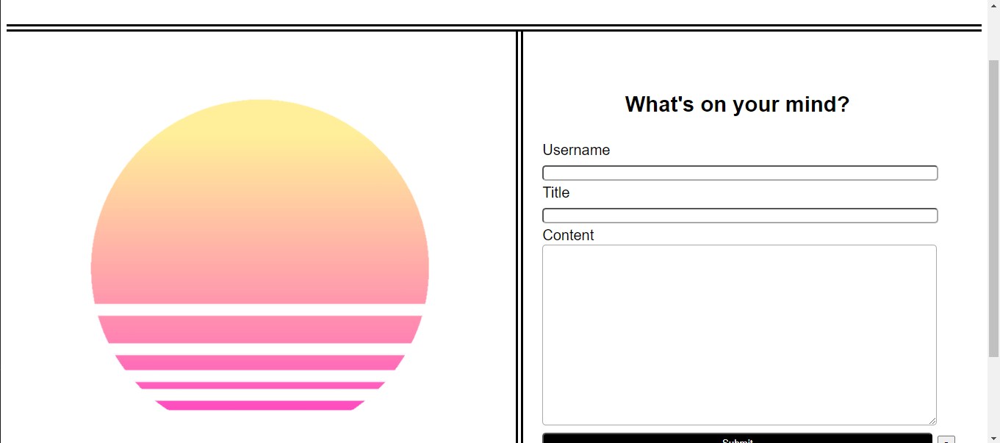
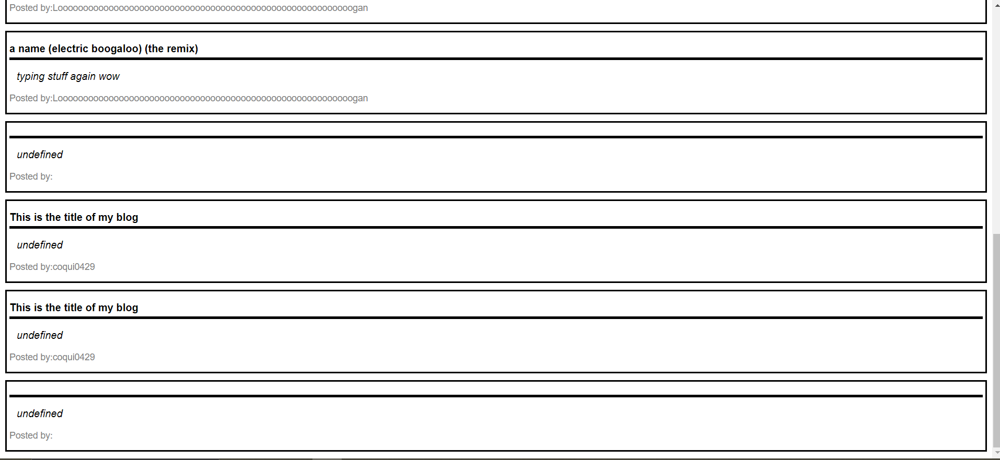
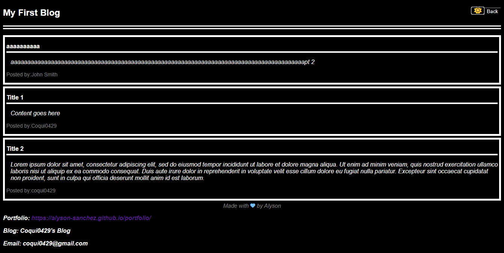

# Blog
A simple blog site that makes use of JSON arrays and the local Storage in order to add user posts to a blog wall. It makes use of several java script files, and features a dark/light mode.

## Installation 
This website will work on any browser, no downloading necessary.

## How to Use
Use this website by writing your thoughts and feelings. Your username, and a title for the post is required (along with the content, of course) or the site will not proceed to the next page. The dark/light feature can be used via the sun icon in the corner.

## Credits
Alyson Sanchez(All coding): https://github.com/Alyson-Sanchez
Matthew Ramsey (Collaborator):https://github.com/pixelking20 